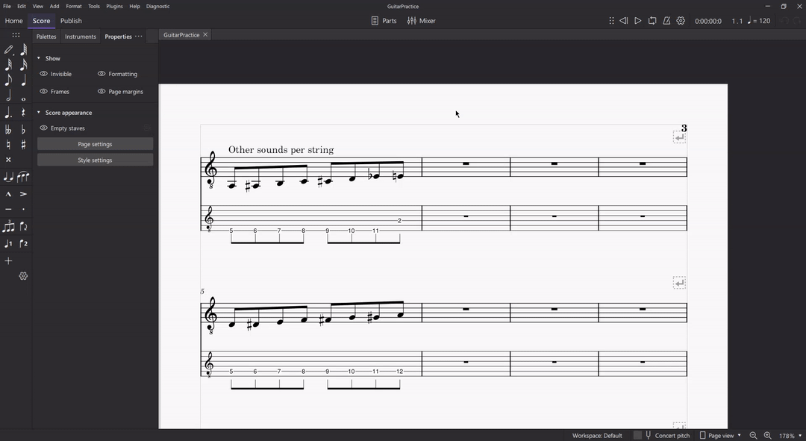

# Insert random notes - MuseScore 4 Plugin

## Overview
Inserts random notes to the score in the specified place. Note input and note value should be specified before clicking "Apply".

## Requirements
- **MuseScore 4.x** - this plugin is not backwards compatible with 3.x

## Installation
1. Download the source.
2. Create a folder in your `Plugins` directory (this directory can be found via Edit->Preferences->General->Folders).
3. Unpack the contents of the source to the newly created folder.
4. Enable the plugin in MuseScore.